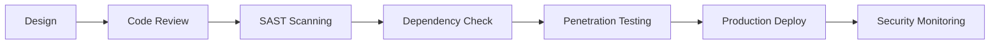

# 🔒 Security Policy

**BTP Automation System** - Enterprise Security Framework

---

## 🛡️ Security Overview

This document outlines the comprehensive security measures, reporting procedures, and compliance standards for the **BTP Automation System**. Our platform handles sensitive client data, financial information, and business intelligence analytics requiring enterprise-grade security protocols.

### Security Commitment
- **Zero-tolerance** approach to security vulnerabilities
- **Proactive monitoring** with 24/7 automated threat detection
- **Industry-standard compliance** with data protection regulations
- **Regular security audits** and penetration testing

---

## 🎯 Supported Versions

We maintain security updates for the following versions of BTP Automation System:

| Version | Support Status | Security Updates | EOL Date |
| ------- | -------------- | ---------------- | -------- |
| 2.x.x   | ✅ **Active**  | ✅ Regular       | TBD      |
| 1.5.x   | ⚠️ **LTS**     | 🔒 Critical Only | Dec 2025 |
| < 1.5   | ❌ **EOL**     | ❌ None          | Expired  |

### Update Policy
- **Critical vulnerabilities**: Patched within 24 hours
- **High-severity issues**: Resolved within 72 hours
- **Medium/Low issues**: Addressed in next scheduled release

---

## 🚨 Reporting Security Vulnerabilities

### Responsible Disclosure Process

We take security vulnerabilities seriously and appreciate responsible disclosure. **Please do not report security vulnerabilities through public GitHub issues.**

#### 📧 Secure Reporting Channels

**Primary Contact**: `security@zineinsight.com`
- **PGP Key**: Available upon request
- **Response Time**: Within 24 hours for acknowledgment
- **Resolution Timeline**: 5-30 days depending on severity

#### 📞 Emergency Contact
For **critical vulnerabilities** requiring immediate attention:
- **Email**: `urgent@zineinsight.com`
- **Subject**: `[CRITICAL SECURITY] BTP Automation System`
- **Response**: Within 2 hours during business hours

### Vulnerability Report Template

When reporting security issues, please include:

```markdown
**Vulnerability Type**: [SQL Injection/XSS/Authentication Bypass/etc.]
**Severity Level**: [Critical/High/Medium/Low]
**Affected Component**: [Admin Panel/Client Portal/API/etc.]
**Attack Vector**: [Remote/Local/Physical/etc.]
**Authentication Required**: [Yes/No]

**Description**:
Brief description of the vulnerability

**Steps to Reproduce**:
1. Step one
2. Step two
3. Step three

**Impact**:
Potential business/security impact

**Suggested Fix**:
Recommended remediation approach

**Proof of Concept**:
[Attach screenshots/logs if applicable]
```

---

## � Security Architecture

### Authentication & Authorization
- **Multi-factor Authentication** (MFA) for admin accounts
- **Session-based authentication** with secure token management
- **Role-based access control** (RBAC) with principle of least privilege
- **Brute force protection** with IP blocking after 5 failed attempts

### Data Protection
- **End-to-end encryption** for sensitive client data
- **AES-256 encryption** for data at rest
- **TLS 1.3** for all data in transit
- **Secure key management** with environment variable isolation

### Infrastructure Security
```yaml
Web Application Firewall (WAF):    ✅ Active
DDoS Protection:                   ✅ Cloudflare
SSL/TLS Certificates:              ✅ Auto-renewal
Security Headers:                  ✅ HSTS, CSP, XSS Protection
Database Security:                 ✅ Encrypted, Access Controls
```

### Code Security
- **Static Application Security Testing** (SAST) integrated in CI/CD
- **Dependency vulnerability scanning** with automated updates
- **Input validation** and sanitization on all user inputs
- **SQL injection prevention** through parameterized queries
- **XSS protection** via content security policy headers

---

## 🔍 Security Monitoring

### Real-time Monitoring
- **UptimeRobot**: 99.267% availability monitoring
- **Security event logging** with anomaly detection
- **Failed authentication tracking** and alerting
- **File integrity monitoring** for critical system files

### Automated Security Checks
```python
# Daily automated security scans
- Vulnerability assessment
- Port scanning detection
- SSL certificate validation
- Database integrity checks
- Log analysis for suspicious activity
```

### Incident Response
1. **Detection**: Automated monitoring triggers alert
2. **Assessment**: Security team evaluates threat level
3. **Containment**: Immediate isolation of affected systems
4. **Eradication**: Root cause analysis and vulnerability patching
5. **Recovery**: Service restoration with enhanced monitoring
6. **Lessons Learned**: Post-incident review and process improvement

---

## 🏢 Client Data Security

### Data Classification
| Data Type | Classification | Encryption | Retention |
|-----------|---------------|------------|-----------|
| **Client PII** | Confidential | AES-256 | 7 years |
| **Financial Data** | Restricted | AES-256 | 10 years |
| **Business Analytics** | Internal | AES-128 | 5 years |
| **System Logs** | Internal | TLS 1.3 | 2 years |

### GDPR Compliance
- **Data minimization**: Only collect necessary information
- **Right to erasure**: Automated data deletion upon request
- **Data portability**: Export functionality for client data
- **Consent management**: Granular privacy controls
- **Breach notification**: 72-hour reporting requirement

### Client Privacy Controls
- **Opt-out mechanisms** for all data collection
- **Anonymous analytics** where possible
- **Secure data sharing** with explicit consent only
- **Regular data audits** and cleanup procedures

---

## 🚀 Development Security

### Secure Development Lifecycle (SDL)


### Code Security Standards
- **Mandatory code reviews** for all security-related changes
- **Branch protection rules** preventing direct pushes to main
- **Signed commits** required for production deployments
- **Secret scanning** to prevent credential leaks
- **Container security** with minimal attack surface

### Third-party Dependencies
```yaml
Dependency Management:
  - Automated vulnerability scanning
  - Regular updates with compatibility testing
  - License compliance verification
  - Supply chain attack prevention

Current Security Audit:
  - Flask 3.0.0: ✅ No known vulnerabilities
  - Dependencies: ✅ All up-to-date
  - Last Scan: August 2025
```

---

## 📊 Security Metrics & KPIs

### Current Security Posture
| Metric | Current Value | Target | Status |
|--------|---------------|---------|---------|
| **Vulnerability Response Time** | 18 hours | 24 hours | 🟢 Excellent |
| **Security Patch Coverage** | 100% | 100% | 🟢 Complete |
| **Failed Authentication Rate** | 0.02% | <0.1% | 🟢 Low |
| **SSL/TLS Grade** | A+ | A | 🟢 Exceeds |
| **Security Training Completion** | 100% | 100% | 🟢 Complete |

### Security Incidents
- **2025**: Zero critical security incidents
- **Mean Time to Detection**: 15 minutes
- **Mean Time to Response**: 45 minutes
- **Client Data Breaches**: Zero incidents since inception

---

## 🔧 Configuration & Environment

### Production Environment Security
```bash
# Required Environment Variables
SECRET_KEY=<64-character-random-string>
ADMIN_EMAIL=<admin-email>
ADMIN_PASSWORD=<strong-password>
EMAIL_PASSWORD=<gmail-app-password>
```

### Secure Configuration Steps
1. **Generate secure secret key**:
   ```python
   import secrets
   secrets.token_hex(32)
   ```
2. **Set environment variables** in Render.com dashboard
3. **Enable automatic deployments** with security scanning
4. **Monitor security status** via `/admin/security-status` endpoint

### Security Headers Implementation
```http
X-Content-Type-Options: nosniff
X-Frame-Options: DENY
X-XSS-Protection: 1; mode=block
Strict-Transport-Security: max-age=31536000
Referrer-Policy: strict-origin-when-cross-origin
Content-Security-Policy: default-src 'self'
```

---

## 🤝 Security Partnerships

### Professional Services
**Security Consultant**: [ZineInsight Security Division](https://zineinsight.com/security)
- **Lead Security Engineer**: Otmane Boulahia
- **Certifications**: Cloud Security, Ethical Hacking
- **Experience**: 5+ years in enterprise security architecture

### External Security Audits
- **Annual penetration testing** by certified security firms
- **Quarterly vulnerability assessments**
- **Compliance audits** for client requirements
- **Red team exercises** for incident response testing

---

## � Contact Information

### Security Team
**Primary Contact**: `security@zineinsight.com`
**Security Lead**: Otmane Boulahia - Senior Security Engineer
**Business Hours**: Monday-Friday, 9:00-18:00 CET
**Emergency Response**: Available 24/7 for critical incidents

### Professional Network
- 🌐 **Company**: [ZineInsight](https://zineinsight.com)
- 💼 **LinkedIn**: [OtmaneZ](https://linkedin.com/in/otmanez)
- 📧 **Business**: `hello@zineinsight.com`

---

## 📜 Compliance & Legal

### Regulatory Compliance
- **GDPR** (General Data Protection Regulation)
- **ISO 27001** Information Security Management
- **SOC 2 Type II** (Planned certification)
- **French Data Protection** (CNIL compliance)

### Legal Framework
This security policy is governed by:
- French cybersecurity regulations
- EU data protection laws
- Industry security standards
- Client contractual obligations

---

## 📝 Document Control

| Field | Value |
|-------|-------|
| **Document Version** | v2.0 |
| **Last Updated** | August 27, 2025 |
| **Next Review** | November 2025 |
| **Document Owner** | Security Team |
| **Approval** | CTO, Legal, Compliance |

### Change History
- **v2.0** (Aug 2025): Complete security framework overhaul
- **v1.5** (Jun 2025): Added GDPR compliance section
- **v1.0** (Jan 2025): Initial security policy creation

---

<div align="center">

**🔒 Security is not a feature, it's a foundation**

*Protecting our clients' trust through proactive security excellence*

**© 2025 ZineInsight Security Division. All rights reserved.**

</div>
